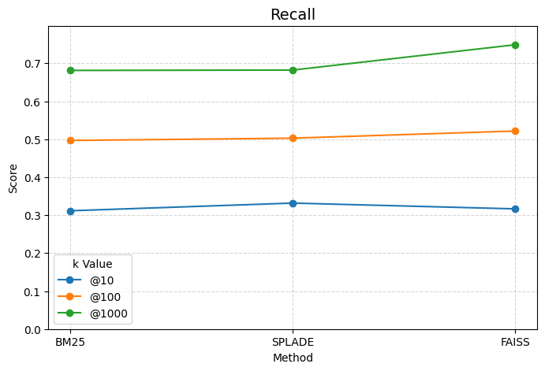
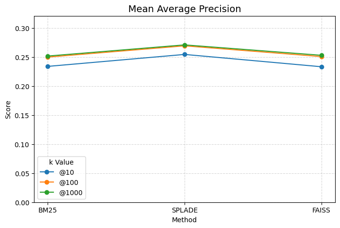
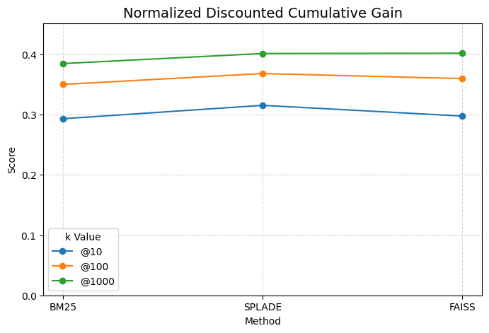
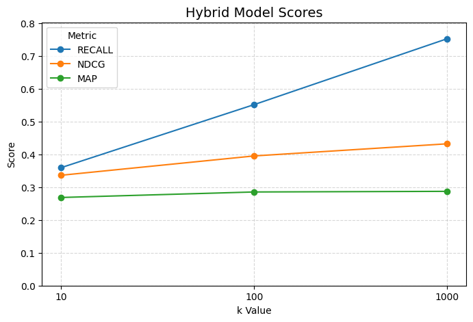

# 📄 Patent Retrieval Evaluation Report (WPI\_60K)

## 🏗️ Evaluation Setup

This project evaluates hybrid retrieval methods on the **WPI\_60K** patent collection (63,923 documents) using a combination of:

- **BM25** (traditional sparse retrieval)
- **SPLADE** (sparse transformer-based representation)
- **FAISS** (dense cosine similarity)
- Optionally: **Cross-Encoder Reranking** (on CPU)

### Query Topics

- 923 XML patent files (e.g., `EP-2874114-A1.xml`) extracted from the `test_topics` directory.
- Ground truth: TREC-style `Prior_art_qrels.txt`.

### 📖 Document Dictionary

- The 63k patent documents were parsed from raw `.txt` files into structured `.json` using `BeautifulSoup` for XML/HTML extraction.
- A curated JSON document dictionary (`doc_dict.json`) was later built with fields:

```json
{
  "doc_id": "US-8998284-B1",
  "title": "...",
  "abstract": "...",
  "claims": "...",
  "description": "...",
  "search_text": "title + abstract + first 500 claims + first 500 description words"
}
```

This dictionary powers both indexing and evaluation consistently.

---

## 🔭 Retrieval Pipelines

### ⓑ BM25 (sparse)

- Implemented via `rank_bm25.BM25Okapi`
- Lemmatized input via spaCy
- Indexed over `search_text`

### ⓢ SPLADE (sparse, transformer-based)

- Model: `naver/splade-cocondenser-ensembledistil`
- Indexed as `splade_vectors_v3.jsonl`
- Retrieved using sum/max-agg matching with query token overlap.

### ⓕ FAISS (dense cosine)

- Model: `sentence-transformers/all-MiniLM-L6-v2`
- Index: `wpi60k_faiss_cosine.index` (IVF cosine flat)
- 63,923 vectors (dim=384)

### 🔰 Cross-Encoder Reranker (optional)

- `cross-encoder/ms-marco-TinyBERT-L-2-v2`
- CPU-only execution
- Extremely slow (\~4s/query) — optional via config flag

---

## ⚖️ Hybrid Scoring

The hybrid ranker linearly combines normalized scores:

```python
final_score = α * BM25 + β * SPLADE + γ * FAISS
```

- Dynamic weighting based on query length (e.g., FAISS favored for long queries).
- Query expansion applied (lemmatization and repeated tokens).
- Lemmatized queries used across all components for alignment.

---

## 📉 Weight Tuning Experiments

| BM25 | SPLADE | FAISS | Reranker  | R\@100 | NDCG\@10   | MAP\@1000  |
| ---- | ------ | ----- | --------- | ------ | ---------- | ---------- |
| 3    | 4      | 3     | none      | 0.5528 | 0.3319     | 0.2828     |
| 1    | 3      | 6     | none      | 0.5961 | **0.3750** | **0.3324** |
| 3.3  | 3.3    | 3.3   | tinyBert  | 0.5219 | 0.3252     | 0.2770     |

> 📣 Best metrics achieved with **BM25:1 — SPLADE:3 — FAISS:6** and no reranker.


<br>Scores of models ran individually
<p align="center">
  
  
  
</p>


<br>Scores of hybrid approach


---

## ⓟ️ Excluded: Pyserini 

We **attempted to integrate Pyserini** (BM25, SPLADE, ANCE baselines), but faced consistent issues:

- ❗❗ **Colab**: `nmslib` install and runtime errors, including segmentation faults.
- ❌ **Local** (Zorin Linux): Python versions incompatibilities with `castorini/pyserini`, unresolved setup conflicts.

> After several hours of debugging, we opted for a self-contained, dependency-light pipeline that remained portable on both Colab and CPU-only Linux systems.

---

## 🜲 Conclusion

This evaluation:

- Built a clean, lemmatized document corpus
- Implemented a hybrid search engine combining BM25, SPLADE, FAISS
- Tuned weights to maximize recall and MAP
- Evaluated 923 & 2542 TREC-style queries against 63k+ patents
- Demonstrated a flexible, CPU-compatible hybrid retrieval 

